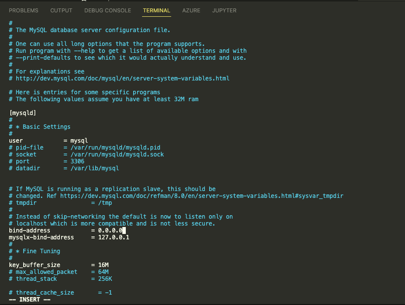

# prerequisite

* Start 2 AWS instance (one for sql client and the other for sql server)

#  MySQL SERVER steps

* Installing myslq server

* Enable sql server service

* Set sql server password

* Run security scipts on sql server
  sudo mysql_secure_installation

  

* Create a new remote user, and database on SQL server using the following commands

    CREATE USER  'remote_user' @'%' IDENTIFIED WITH mysql_native_password BY 'PassWord.1';
    CREATE DATABASE test_db
    GRANT ALL ON test_db.* TO 'remote_user'@'%' WITH GRANT OPTION;
    FLUSH PRIVILEGES

    

* Configure sql server to allow connections from remote host
    sudo vi /etc/mysql/mysql.conf.d/mysqld.cnf

    

* Restart mysql for client

#  MySQL CLIENT steps

* Install SQL Client

* Get IP address for sql client instance

* Connect to SQL Server from SQL CLIENT

